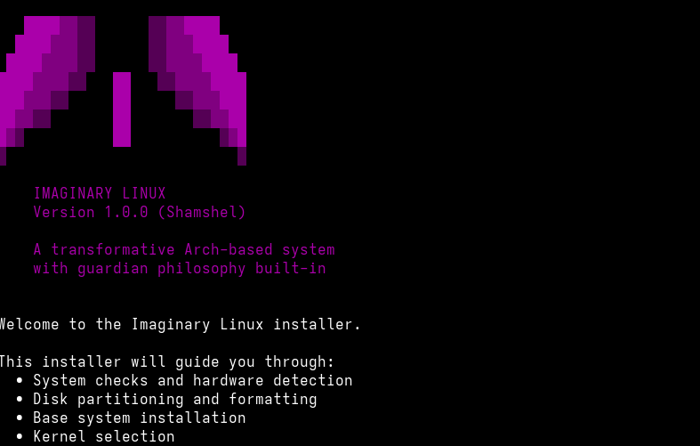
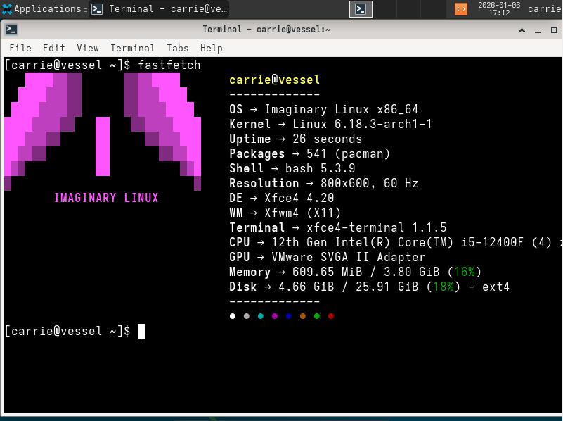

# Imaginary Linux

```
   ████▓▓▒▒      ▒▒▓▓████
  ████▓▓▓▒▒      ▒▒▓▓▓████
 ████▓▓▓▓▒▒      ▒▒▓▓▓▓████
████▓▓▓▓▒▒   ██   ▒▒▓▓▓▓████
███▓▓▓▒▒     ██     ▒▒▓▓▓███
██▓▓▒▒       ██       ▒▒▓▓██
█▓▒          ██          ▒▓█
▒                          ▒
       IMAGINARY LINUX
```

**Version 1.1.6 (Shamshel)**  
*A hardened, minimal Arch-based Linux distribution*

[](LICENSE)
[](https://archlinux.org/)

---

## 📖 About

Imaginary Linux is a security-focused, user-friendly Arch-based distribution designed for intermediate Linux users who want a clean, customizable system without the complexity of manual Arch installation.

### Why Imaginary?

- 🛡️ **Security First** - Hardened kernel options, AppArmor support, firewall enabled by default
- ⚡ **Fast & Lightweight** - Minimal bloat, optimized for performance
- 🎨 **Customizable** - Choose from 7 desktop environments/window managers
- 🔧 **Automated Installation** - Full CLI installer handles everything
- 🎯 **Arch-Based** - Rolling release, access to AUR, pacman package manager

### Screenshots

<div align="center">

**Installer**  


**Terminal**  


</div>

---

## ✨ Features

### Installation

- **Automated CLI installer** - No manual partitioning or configuration needed
- **Multiple desktop environments** - GNOME, KDE, XFCE, Cinnamon, BSPWM, i3, Hyprland
- **Custom BSPWM rice** - Pre-configured beautiful setup for BSPWM users
- **Dual boot aware** - Detects other operating systems

### Security

- **Hardened kernel options** - Security-focused kernel parameters
- **AppArmor support** - Mandatory Access Control framework
- **UFW firewall** - Enabled and configured by default
- **System hardening** - Optional security hardening during installation
- **Minimal attack surface** - Only essential packages installed

### Desktop Environments

| Environment | Type | Description |
|------------|------|-------------|
| **GNOME** | Full DE | Modern, feature-rich desktop |
| **KDE Plasma** | Full DE | Highly customizable, powerful |
| **XFCE** | Full DE | Lightweight, classic experience |
| **Cinnamon** | Full DE | Traditional desktop layout |
| **BSPWM** | WM | Tiling window manager with custom rice |
| **i3** | WM | Popular tiling window manager |
| **Hyprland** | WM | Modern Wayland compositor |

### Package Management

- **pacman** - Fast, efficient package manager
- **AUR support** - Choose between paru or yay
- **Minimal base** - Install only what you need
- **Optional packages** - Curated selection of common applications

---

## 🚀 Quick Start

### Download

Download the latest release from [GitHub Releases](https://github.com/yourusername/imaginary-linux/releases)

### Installation

1. **Boot from any Arch Linux ISO**
2. **Connect to the internet:**

   ```bash
   systemctl start NetworkManager
   nmtui
   ```

3. **Clone the repository:**

   ```bash
   git clone https://github.com/digitalcanine/imaginary-linux.git
   cd imaginary-linux
   ```

4. **Run the installer:**

   ```bash
   sudo ./installer/install.sh
   ```

5. **Follow the prompts** - The installer will guide you through the process

See [INSTALL.md](INSTALL.md) for detailed installation instructions.

---

## 📦 What's Included

### Base System

- Linux kernel (choice of standard, LTS, zen, or hardened)
- Base-devel tools
- NetworkManager
- Git, vim, fastfetch
- Auto-detected hardware drivers (GPU, audio, network)

### Desktop Profiles

**Minimal Installation:**

- Desktop environment/window manager
- Terminal emulator (kitty)
- Web browser (Firefox)
- Essential utilities

**Full Installation:**

- Everything in Minimal
- File manager
- Archive tools
- System utilities
- Multimedia support

### Optional Packages (CURRENTLY NOT WORKING)

Choose from curated categories:

- Web browsers (Firefox, Chromium, Brave, LibreWolf)
- Editors (Neovim, VS Code, VSCodium)
- Communication (Discord, Telegram, Signal)
- Development tools (Docker, Git, GitHub CLI)
- Gaming (Steam, Lutris, Wine)
- And more...

---

## 🛠️ Advanced Features

### System Hardening

Optional security hardening includes:

- Kernel parameter hardening (dmesg_restrict, kptr_restrict, ASLR)
- Restricted ptrace access
- Core dump disabling
- Secure umask (077)
- SSH hardening
- Systemd security settings
- AppArmor integration
- Automatic security updates (optional)

### Bootloader Options

- **systemd-boot** (UEFI, recommended)
- **GRUB** (UEFI and BIOS)

### Partition Schemes

- Btrfs with snapshots
- Swap (file, partition, or zram)

---

## 📚 Documentation

- [Installation Guide](INSTALL.md) - Detailed installation instructions
- [Troubleshooting](docs/TROUBLESHOOTING.md) - Common issues and solutions
- [Customization Guide](docs/CUSTOMIZATION.md) - Personalize your system
- [Contributing](docs/CONTRIBUTING.md) - Help improve Imaginary Linux

---

## 🔄 Version

### Version 1.1.6 (Shamshel) - Current

- Initial real public release
- Automated installer
- 7 desktop environment options
- Security hardening features
- UEFI and BIOS support
- Imaginary Angel script bundled in

### Roadmap to version 2.X.X (Ramiel)

- [] Custom kernel
- [] Imaginary Angel 2.0.0
- [] Better hardening
- [] More angelic theming
- [] Allow to keep old partitions
- [] LUKS encryption during the installer

### Version history

- 0.5.6 (Sachiel) - First prototype of the OS
- **1.1.X (Shamshel)** - Current stable series
- 2.X.X (Ramiel) - Future major release

---

## 🤝 Contributing

Contributions are welcome! Whether it's:

- Bug reports
- Feature requests
- Code improvements
- Documentation
- New desktop environment profiles

---

## 📝 License

Imaginary Linux is released under the MIT License. See [LICENSE](LICENSE) for details.

The installer scripts and configurations are MIT licensed.  
The Linux kernel and included packages retain their original licenses.

---

## 🙏 Credits

- **Arch Linux** - The foundation of this distribution
- **Chris Titus Tech** - Inspiration for the automated installer concept
- Evangelion - Angel naming scheme
- All the open source projects that make this possible

---

## 📞 Support

- **Issues:** [GitHub Issues](https://github.com/digitalcanine/imaginary-linux/issues)
- **Discussions:** [GitHub Discussions](https://github.com/digitalcanine/imaginary-linux/discussions)

---

## ⚠️ Disclaimer

Imaginary Linux is provided as-is without warranty. This is a hobby project created for personal use and shared with the community. Always backup your data before installation.
